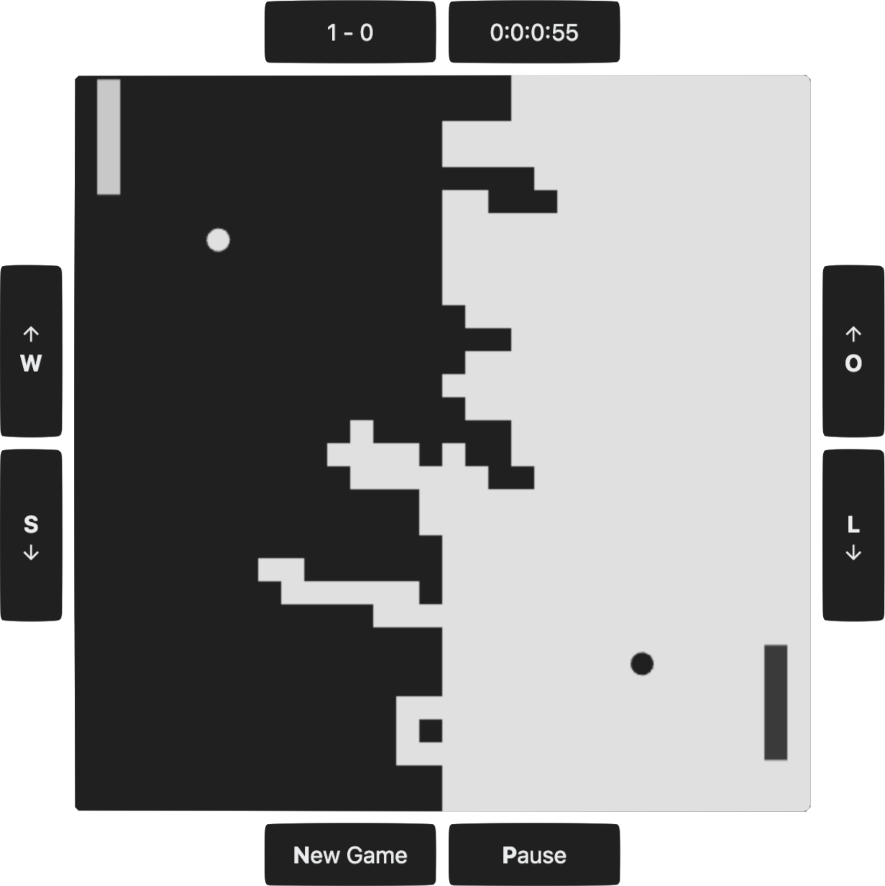

# Duel of the Paddles

Yet another pong game.



## Requirements

- [Docker](https://www.docker.com)
- [Node.js](https://nodejs.org) (only for development)

## Usage

### Run everything in Docker

This option builds and runs everything in Docker and it is suitable for testing purposes.

```shell
docker compose --file scripts/docker/docker-compose.yml up
```

> You need to build the images with `--build` flag above, if you make any changes to the source code.

### Development Environment

This option runs the app via Node.js. It's suitable for development purposes.


```shell
# Install the dependencies (if not already installed)
npm install -g typescript && npm install

# Start the development server
npm run dev

# To run the server in production mode
npm run build && npm run start
```

## Contributing

See [CONTRIBUTING.md](CONTRIBUTING.md)

## License

Licensed under The MIT License (MIT)  
For the full copyright and license information, please view the LICENSE.txt file.
